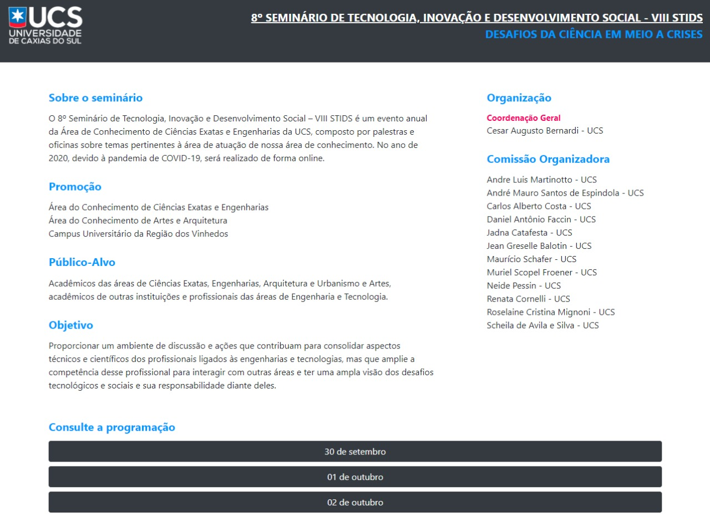
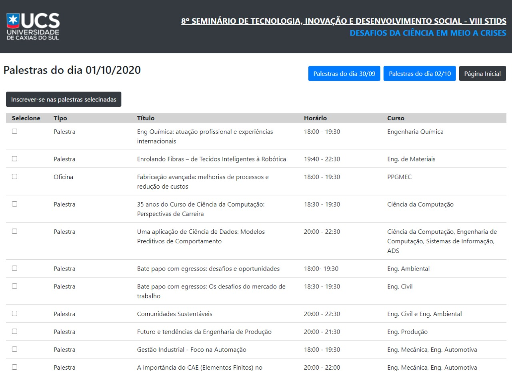
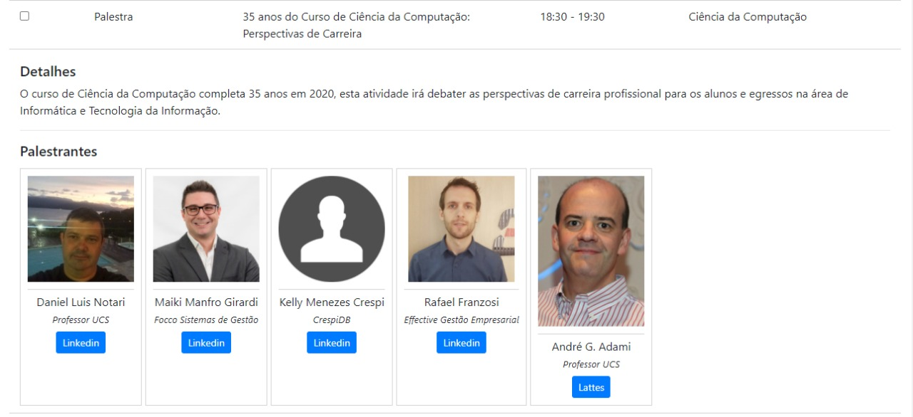
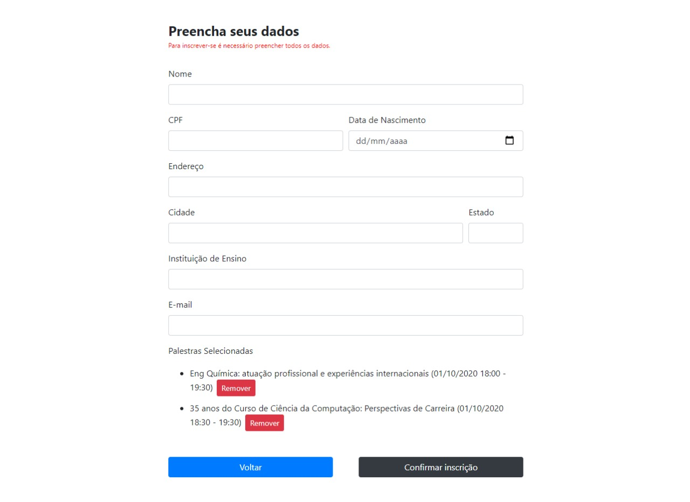

# 8º Seminário de Tecnologia, Inovação e Desenvolvimento Social – VIII STIDS

### Site de divulgação do seminário.
### Projeto desenvolvido para a disciplina de Programação de Aplicações Web I, da Universidade de Caxias do Sul (UCS), no semestre 04/2020.

 
 

<!-- ### Para acessá-lo
O site pode ser acessado através do link: https://emersonjahn.github.io/Seminario_de_Tecnologia

  -->

### Tecnologias utilizadas
- HTML 5
- JavaScript
- JQuery
- CSS
- Bootstrap

 

### Preview

<table border=0>
    <tr>
        <td>
            
        </td>
        <td>
            
        </td>
    </tr>
    <tr>
        <td>
            
        <td>
            
        </td>
    </tr>
</table>

 

### Autores

<table border=0>
<tr>
<td>
<a href="https://github.com/EmersonJahn">

 
<b>Emerson Jahn</b></a> 

 
 
 

</td>
<td>
<a href="https://github.com/donelli">

 
<b>Eduardo Donelli Pellenz</b></a> 

 

</td>
</tr>

</table>

